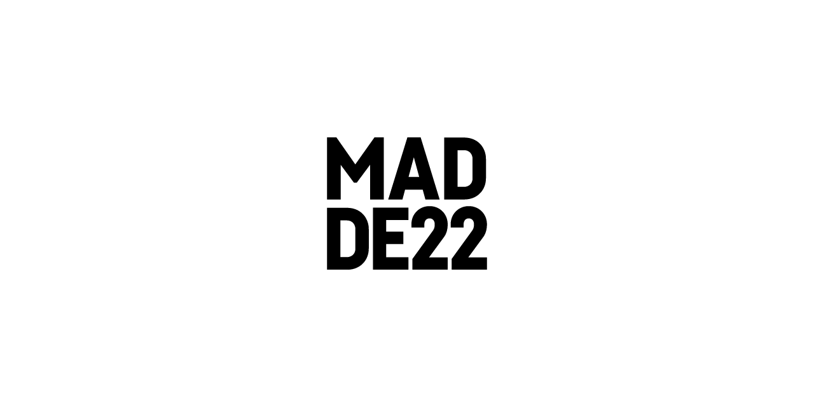
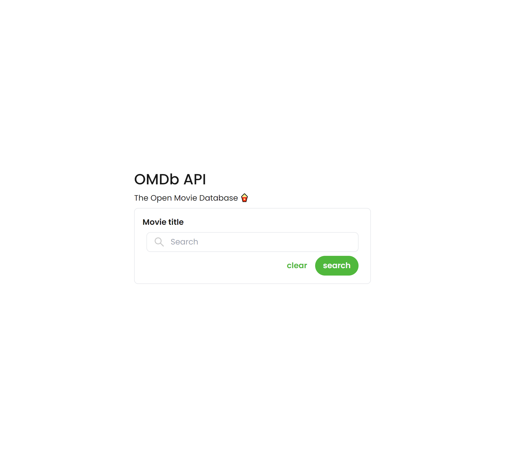
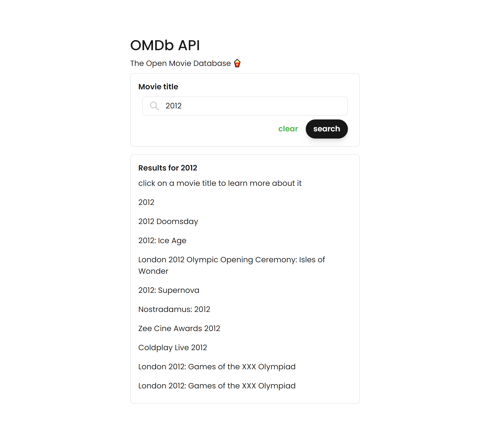
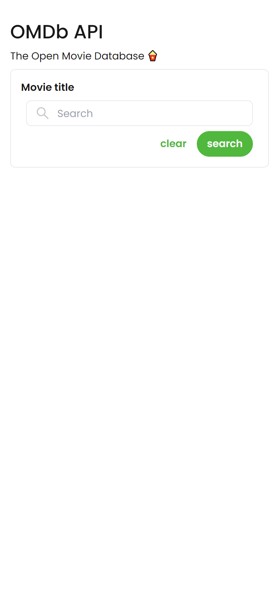
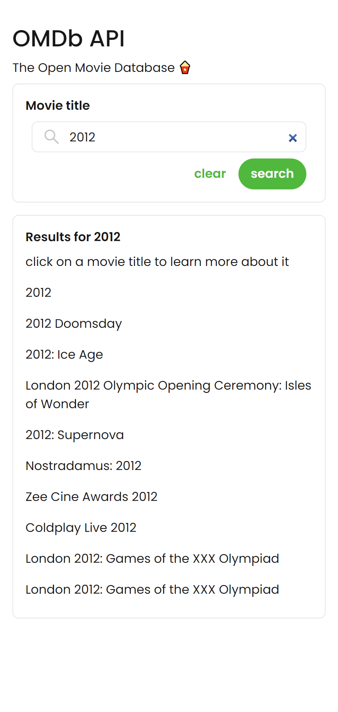

# Madde 22 Frontend Developer Challenge

## Çalışma Hakkında

OMDB'de film araması yapan ve sonuçları tasarımdaki gibi listeleyen websitesi.

> https://madde22-challenge.herokuapp.com

## Kullanılan Teknolojiler

- ReactJS
- Tailwindcss
- OMDB API

## Komutlar

### `yarn start`

Uygulamayı geliştirme modunda çalıştırır.\
Tarayıcıda görüntülemek için [http://localhost:3000](http://localhost:3000) linkini açın.

### `yarn watch`

Tailwindcss'i `style.css` dosyasında derler.

## Tasarım

|                            Masaüstü Giriş                             |                            Masaüstü Arama                             |
| :-------------------------------------------------------------------: | :-------------------------------------------------------------------: |
|  |  |

|                             Mobil Giriş                             |                             Mobil Arama                             |
| :-----------------------------------------------------------------: | :-----------------------------------------------------------------: |
|  |  |
